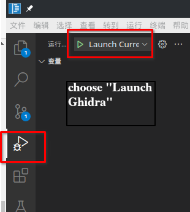

# GhdiraCraft Dev Guide

## Intro

Although the Ghidra project has already provided a [DevGuide](../DevGuide.md), it does not cover some
of the topics one might also get interested.

Also, because of our introduction of extra techs, we might also need extra setups. Some of them are
already added to the original [DevGuide](../DevGuide.md). But to enphasize the difference, we also
write it here.

The topics covered in this dev guide include:

- Dev Environment Setup under IntelliJ IDEA
- Dev Environment Setup under VS Code
- Rust setup
- How we debug Ghidra decompiler (not quite mentioned by Ghidra officially)

And **will not include**: the basic Ghidra Dev Environment that is already covered in the original
dev guide.

## IntelliJ IDEA Dev Setup

TODO

## VSCode Dev Setup

### Language Server Support

1. install Java support plugin: [Java Extension Pack](https://marketplace.visualstudio.com/items?itemName=vscjava.vscode-java-pack).
2. install gradle, make sure it is callable. i.e, typing `gradle` then enter is working. (It **might** be possible
to use gradle wrapper. But we haven't used it. If you are using it, you may take your own risk. But if you do make
it work, feel free to fire a Pull Request to inform other people about how you did it.)
3. prepare the dev env (follows [Orignal DevGuide](../DevGuide.md))

```bash
$ gradle -I gradle/support/fetchDependencies.gradle init
$ gralde prepDev
```

4. import the project (either by reopen the project or use the Java extension pack and import it)
5. wait for it to load (it might take a long time. This is a huge project :) )

After this, you should have a working environment that you can do xref, go to definition, etc.

### Debugging Support

1. Add a new directory, `.vscode`. This is to put your debugging environment setting of vscode.
(It should be ignored by git)
2. Add a new file in the `.vscode` directory, named `launch.json`, you can do this in two
possible ways:
    - add a `launch.json` yourself in the `.vscode` directory, copy the content inside
    - click `run and debug` button in the vscode (normally, it should right below the git submenu),
it will ask you to create a `launch.json`. Use it and we modify it.

The minimal `launch.json` file you need is:

```json
{
    "version": "0.2.0",
    "configurations": [
        {
            "type": "java",
            "name": "Launch Ghidra",
            "request": "launch",
            "projectName": "Framework Utility",
            "mainClass": "ghidra.GhidraLauncher",
            "vmArgs": "-Djava.system.class.loader=ghidra.GhidraClassLoader -DbinaryPath=build/classes/java/main:build/resources/main/:bin/default/::src/main/resources/",
            "classPaths": ["${workspaceFolder}/Ghidra/Framework/Utility/build/classes/java/main"],
            "args": "ghidra.GhidraRun"
        }
    ]
}
```

If you already have configurations, just add that configuration object to the "configurations" then
everything will do.

3. compile the decompiler by running `gradle buildNatives_XXX`
to build the decompiler. The actual value of `xxx` is platform dependant, can be `win64`, `linux64` or
`osx64`.
4. compile the classes by `gradle classes`.
5. **manually copy the decompile binary**. To do this, go to `Ghidra/Features/Decompiler/src/decompile`,
copy `target/release/x86_64-XXXXX/decompile` (XXX depends on your build environment, under linux, this is
`x86_64-unknown-linux-gnu`) to `../../build/os/XXXX` (XXX depends on your environment, under linux,
this is `linux64`, `win64` and `osx64` are also possible).
Note that, if you haven't modified the decompiler code (either Rust or C++) you do this only once.
Or else, every time you modified that, you should do this again to make sure it goes to the correct
dir where Ghidra could find.

This is debug/test only solution, if you use `buildGhidra`, this is automatic.

4. Open up the `run and debug` menu in VSCode, choose the "Launch Ghidra" option, then click "run"



Your breakpoints should also work when running like this.

Because this is a huge project, I personally recommend disable Java Extension Pack's automatic build
functionality and build manually whenever you updated your file.
Also, the autobuild might just test the project, which can be a huge burden to your machine.

This can be done by disable the autobuild option in Language Support for Java (check your extensions).
In this case, every time you modified source code, be sure to run `gradle classes` before running.

### Q & A

1. Q: After follow all the instructions above, when I click run button, it complains about some syntax
errors?

A: Check out the prompt, you should see `proceed` option, click it. The reason of this (well, I think)
might be default Java LSP build things differently from Ghidra's method. So we can just ignore it.

2. Q: I'm on Windows, and the launch is not working.

A: possibly path delimiter issue. Try change the configuration by replacing path delimiter "/" to "\\".